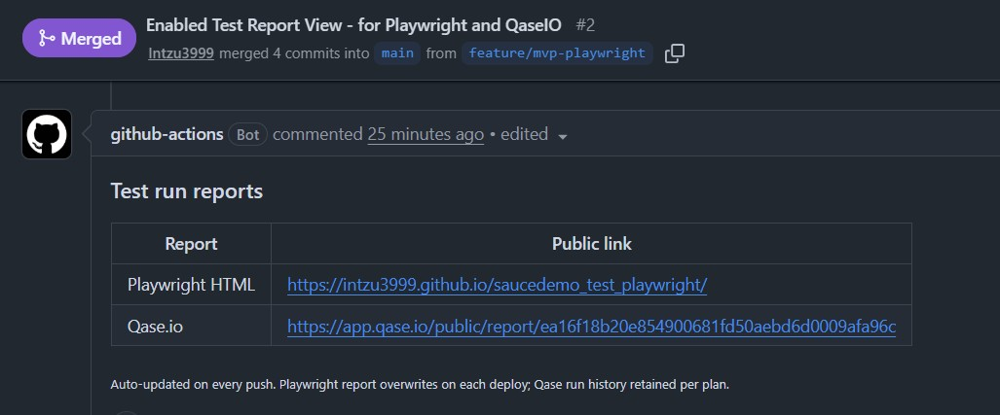

# SauceDemo Playwright Test Framework

End-to-end UI + API automation for
[https://www.saucedemo.com](https://www.saucedemo.com), built with Playwright,
the Page Object Model, a symmetric API-request layer, and CI + Qase.io
reporting wired end-to-end. The point of this repo is to show the whole
pipeline working in one command.

---

## 1. Quick start

```bash
git clone git@github.com:Intzu3999/saucedemo_test_playwright.git
cd saucedemo_test_playwright

# one command: installs Node deps + Chromium + creates .env from .env.example
npm run setup

# run
npm test

# open the HTML report
npx playwright show-report
```

Requires **Node.js 20+** on `PATH`. `npm run setup` is idempotent -- safe to
re-run any time. It never overwrites an existing `.env`.

<details>
<summary>Manual setup (if you prefer not to run the script)</summary>

```bash
npm ci
npx playwright install --with-deps chromium
cp .env.example .env    # then edit .env to add your Qase.io token
```

</details>

**What you should see after `npm test` (39 tests total):**

- **29 pass** -- everything the framework claims should work, works. Includes
  one `@known-bug`-tagged test that currently meets its assertion (SauceDemo's
  delay is action-specific -- more on that under
  [Assumptions & rationale](#5-assumptions--rationale)).
- **10 fail** -- all tagged `@known-bug`. Every one is a real SauceDemo
  product defect. The tests assert the correct behaviour and let the bug
  show up as red.

---

## 2. See it live -- CI, PR reports, Qase.io

The pipeline is wired to run on every push and PR, publish the HTML report
to GitHub Pages, and post a sticky PR comment linking to both the Playwright
report and the Qase.io public run.

To try it end-to-end:

1. Clone, then check out a feature branch: `git checkout -b feature/demo`.
2. Make any trivial change (edit README, touch an empty file).
3. Commit and push the branch.
4. Open a PR into `main`.
5. Wait for the CI check to complete.
6. Open the two report URLs from the sticky PR comment.

Screenshots below are from
[PR #1 -- MVP framework merge](https://github.com/Intzu3999/saucedemo_test_playwright/pull/1),
the first end-to-end demonstration of the pipeline.

**Sticky PR comment linking to both reports:**



**Qase.io -- test run created automatically from Playwright:**


**Qase.io -- individual test cases with steps:**


**Qase.io -- test result dashboard:**


---

## 3. Run modes

Everything is either `npm test` + a filter, or an ad-hoc `npx playwright test`
invocation. Flags after `--` are forwarded to Playwright.

| # | Command | What it runs | Expected result |
|---|---|---|---|
| 1 | `npm test` | Full suite -- 39 tests | 29 pass + 10 fail (10 real SauceDemo bugs, all tagged `@known-bug`) |
| 2 | `npm run test:ci` | Full suite minus `@known-bug` -- 28 tests | All green -- used by CI |
| 3 | `npm run test:known-bugs` | Only `@known-bug` -- 11 tests | 10 fail + 1 pass (SauceDemo behaves correctly on that one today) |
| 4 | `npm run test:smoke` | Only `@smoke` -- 4 tests | 4 pass |
| 5 | `npm test -- --headed` | Full suite with a visible browser | Same as row 1 |
| 6 | `npm test -- --ui` | Playwright's interactive UI mode | Interactive |
| 7 | `npm test -- --debug` | Playwright Inspector (step-through debugger) | Interactive |
| 8 | `npx playwright test --grep "@smoke"` | Any test whose title contains `@smoke` (any tag works) | Depends on filter |
| 9 | `npx playwright test tests/login.spec.js` | One spec file | Depends on file |
| 10 | `npx playwright show-report` | Opens the last HTML report | Report UI |

> **Tags are just strings in test titles.** `test:known-bugs` and `test:smoke`
> are npm shortcuts for `playwright test --grep "@known-bug"` and
> `--grep "@smoke"`. To include a new test in a filter, add the tag to the
> test title -- no config change needed. Full tag list in
> [`docs/test-cases.md`](./docs/test-cases.md).

---

## 4. What's tested

The 39 tests split into four buckets. Every count and status here is
verifiable against the code today (Aug 2026).

| Bucket | Count | Result today | Details |
|---|---|---|---|
| **Required scenarios (assignment 1-4)** | 7 | 7 pass | Valid login, add-to-cart, checkout happy-path + negative, invalid login, locked-out login. See [test-cases.md §1-3](./docs/test-cases.md#1-testsloginspecjs-3-tests----covers-required-scenarios-1--4). |
| **API layer** | 12 | 12 pass | DummyJSON `/users/1` (bonus API + UI cross-check) + `/carts` full CRUD contract + negative cases. See [test-cases.md §4-5](./docs/test-cases.md#4-testsapi-ui-validationspecjs-2-tests----bonus-api--ui-cross-check). |
| **Login access matrix (6 users)** | 6 | 6 pass | Parametrised: every SauceDemo user reaches its expected outcome. See [test-cases.md §6a](./docs/test-cases.md#6a-login-access-matrix----parametrized-across-6-users-6-tests-all-pass). |
| **Known-bug regression (5 buggy users)** | 14 | 4 pass + 10 fail | Every failing test = a real SauceDemo defect. Includes the parametrised add-to-cart matrix (3 pass, 3 fail -- confirms `problem_user`'s "random" bug is actually deterministic). See [test-cases.md §6b-6e](./docs/test-cases.md#6b-problem_user-bugs-9-tests-6-pass-3-fail). |
| **Total** | **39** | **29 pass + 10 fail** | Full inventory in [test-cases.md](./docs/test-cases.md). |


---

## 5. Assumptions & rationale

Read this if you want to understand *why* the results table above looks the
way it does.

### 5.1 What is being tested

The application under test is **SauceDemo itself**, a public demo. SauceDemo
is a frozen fixture designed to ship intentional bugs baked in per user
account. The tests treat those intentional bugs as **real product defects**
and assert the correct behaviour -- exactly as if this were a production
application.

### 5.2 Why bugs are visible as RED (no `test.fail()`)

SauceDemo ships six user accounts. Five of them (`problem`, `performance_glitch`,
`error`, `visual`, plus the special `locked_out`) intentionally exhibit
distinct UI or performance bugs. See
[`test-data/users.json`](./test-data/users.json).

- A known bug should be visible as a red fail in **both** Playwright's HTML
  report and Qase.io. Only that way can a reviewer tell at a glance which
  tests correspond to defects.
- Earlier iterations used Playwright's `test.fail()` marker, which made
  Playwright show them GREEN (expected failure) while Qase showed them RED
  (failed). That inconsistency was removed. **Bug present = RED everywhere.**
- CI stays green because CI runs `npm run test:ci`, which excludes any test
  tagged `@known-bug`. When SauceDemo fixes a bug, the test starts passing,
  we drop the tag, and CI protects the fix from that point on.

### 5.3 What "PASS" and "FAIL" mean here

| Verdict | Meaning |
|---|---|
| **PASS** | Feature works exactly as the site's own documentation claims. |
| **FAIL (known bug)** | Feature is intentionally broken by SauceDemo for a specific user. The framework caught it. |
| **FAIL (unexpected)** | A test regression. Would need investigation -- likely a SauceDemo change or a framework issue. |
| **BLOCKED** | Test could not run (upstream dependency down, environment issue). |

### 5.4 Automation-only finding: `problem_user`'s "random" bug is deterministic

The assignment prompt described the `problem_user` Add-to-Cart failure as
"random". Parametrising the test across all 6 products revealed the
"randomness" is actually deterministic:

- Products **1 (Backpack), 2 (Bike Light), 5 (Onesie)** -- Add-to-Cart works.
- Products **3 (Bolt T-Shirt), 4 (Fleece Jacket), 6 (Red T-Shirt)** -- click
  is silently swallowed.

Documented example of automation adding QA signal manual observation missed.

### 5.5 Other assumptions

- The default password `secret_sauce` is public demo data and is checked in
  to `.env.example` -- not a secret leak.
- `.env` (with the real Qase token) is gitignored and never committed.
- Chromium alone is sufficient for the assignment; Firefox / WebKit projects
  are commented out in `playwright.config.js`.
- The corporate SSL workaround (`IGNORE_HTTPS_ERRORS`) is off by default and
  is only ever needed locally when running behind a proxy that MITMs TLS
  (e.g. Zscaler). CI leaves it off so TLS verification stays strict.

---

## 6. Additional information

### 6.1 Framework overview

- **Language / runtime:** JavaScript on Node.js 20+.
- **Test runner:** `@playwright/test`.
- **Design pattern:** Page Object Model for UI (`pages/*.js`) with a
  symmetric API-request layer (`api/*.js`). Locators and HTTP details live
  inside those classes; specs only call semantic methods.
- **Test data:** externalised as JSON (`test-data/*.json`) and consumed via
  `utils/helpers.js`.
- **Fixtures:** `utils/fixtures.js` extends Playwright's `test` to inject
  pre-configured API clients (`dummyJsonUsers`, `dummyJsonCarts`) the same
  way `page` is injected for UI tests.
- **Reporting:** Playwright HTML + JUnit XML + optional Qase.io TestOps
  publishing.
- **Failure diagnostics:** screenshots (on failure), videos and traces
  (retained on failure) under `test-results/`.
- **CI/CD:** GitHub Actions workflow (`.github/workflows/playwright.yml`)
  and a Jenkins declarative pipeline (`Jenkinsfile`) both pre-wired.

### 6.2 Folder structure

```
saucedemo_test_playwright/
├── .github/workflows/                  # GitHub Actions CI workflow
├── pages/                              # Page Object Models (UI)
│   ├── BasePage.js
│   ├── LoginPage.js
│   ├── InventoryPage.js
│   ├── CartPage.js
│   ├── CheckoutPage.js
│   └── CompletePage.js
├── api/                                # API request objects (POM for HTTP)
│   ├── BaseApi.js                        # get / post / put / patch / delete
│   ├── DummyJsonUsersApi.js              # /users endpoints
│   ├── DummyJsonCartsApi.js              # /carts endpoints (all verbs)
│   ├── schemas.js                        # response shape validators
│   └── index.js
├── tests/                              # Test specs
│   ├── login.spec.js                     # required Scenarios 1 & 4
│   ├── cart.spec.js                      # required Scenario 2
│   ├── checkout.spec.js                  # required Scenario 3
│   ├── api-ui-validation.spec.js         # Bonus (API + UI cross-check)
│   ├── api-carts.spec.js                 # API-only: GET/POST/PUT/PATCH/DELETE
│   └── user-bugs.spec.js                 # Known-bug matrix for all 6 users
├── test-data/                          # JSON test data (no logic)
│   ├── users.json
│   ├── products.json
│   └── checkout.json
├── utils/                              # Helpers + Playwright fixtures
│   ├── helpers.js                        # loginAs*, testData, envOrDefault
│   └── fixtures.js                       # test.extend + API-client injection
├── docs/                               # Reference docs (only test-cases.md is committed)
│   └── test-cases.md                     # Full 39-test inventory + tags
│                                          # (other files under docs/ are gitignored
│                                          #  personal working notes)
├── postman/                            # Postman collections (DummyJSON, Qase)
│   ├── DummyJSON-Carts.postman_collection.json
│   ├── Qase-TestCases.postman_collection.json
│   └── README.md
├── images/                             # README screenshots
├── scripts/                            # Ops scripts (Node CLIs)
│   ├── setup.mjs                         # First-time repo setup
│   └── qase-cleanup.mjs                  # Clear stuck / phantom Qase runs
├── playwright.config.js                # Playwright + reporters config
├── Jenkinsfile                         # Jenkins declarative pipeline
├── .env                                # Local secrets (gitignored)
├── .env.example                        # Template for .env
├── README.md
└── package.json
```

### 6.3 Reports & artefacts

- **HTML report:** `playwright-report/index.html` -- open with
  `npx playwright show-report`.
- **JUnit XML:** `test-results/junit.xml` -- consumed by CI.
- **Traces / videos / screenshots:** `test-results/` -- kept only for
  failing tests.

### 6.4 Qase.io integration

Already wired end-to-end. `.env` holds the API token and the project code
(`SAUCEPW`). Set `QASE_MODE=testops` to publish results; leave `off` to run
purely locally.

When `QASE_TESTOPS_SHOW_PUBLIC_REPORT_LINK=true` (default in `.env`), the
reporter prints both URLs at the end of every run:

```
qase: Test run link:      https://app.qase.io/run/SAUCEPW/dashboard/<id>
qase: Public report link: https://app.qase.io/public/report/<token>
```

The internal link needs a Qase login; the public link is view-only, no login.

#### Cleaning up phantom / stuck Qase runs

If a test run is aborted (Ctrl+C, IDE kill, crash), the reporter's `onBegin`
already created the run on Qase but `onEnd` never fires -- so the run is
stuck "In progress" with 0 stats. Fix with:

```bash
npm run qase:cleanup                    # dry-run: show stuck + empty runs
npm run qase:cleanup -- --complete      # mark stuck runs complete
npm run qase:cleanup -- --delete-empty  # delete runs with 0 results
npm run qase:cleanup:auto               # both (--all)
```

Script lives at `scripts/qase-cleanup.mjs` and reuses the
`QASE_TESTOPS_API_TOKEN` / `QASE_TESTOPS_PROJECT` from `.env`.

### 6.5 CI/CD

- **GitHub Actions** (`.github/workflows/playwright.yml`) runs on push,
  pull request, and manual trigger. Installs Node 20, dependencies, and
  Chromium, then runs `npm run test:ci` (excludes known bugs) and uploads
  `playwright-report/` + `test-results/` as artefacts. Also deploys the
  HTML report to GitHub Pages and posts a sticky PR comment with links.
- **Jenkins** (`Jenkinsfile`) has parity with the GitHub workflow:
  install, browsers, tests, publish JUnit + HTML.

### 6.6 License

MIT
