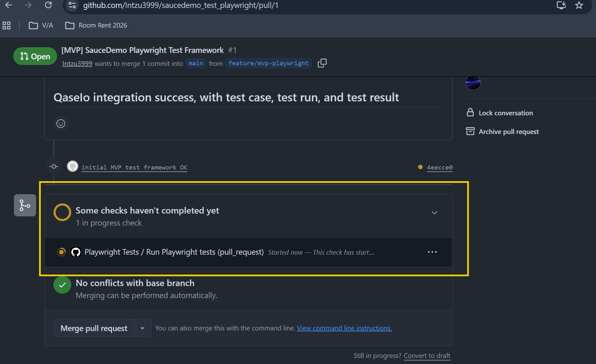
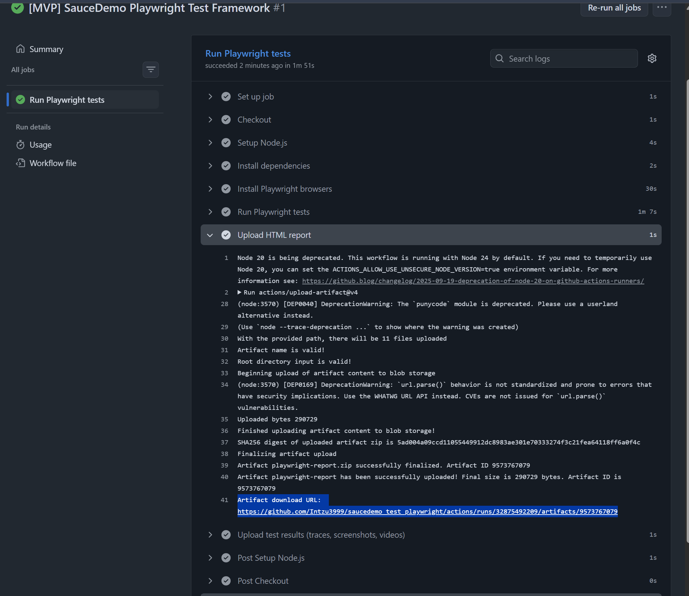
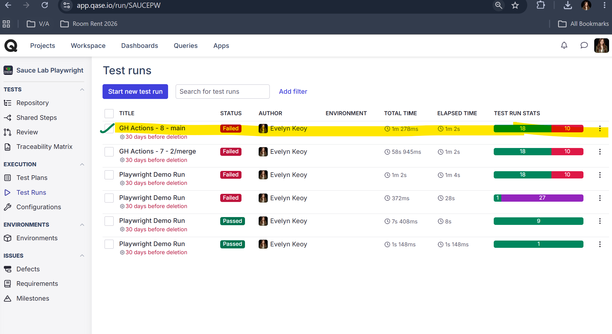
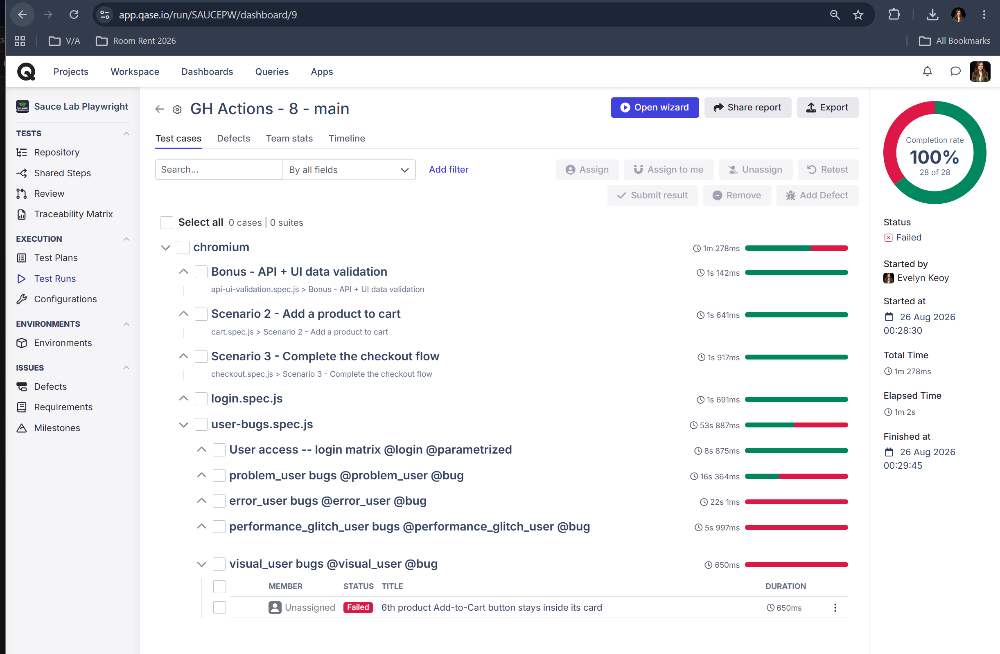
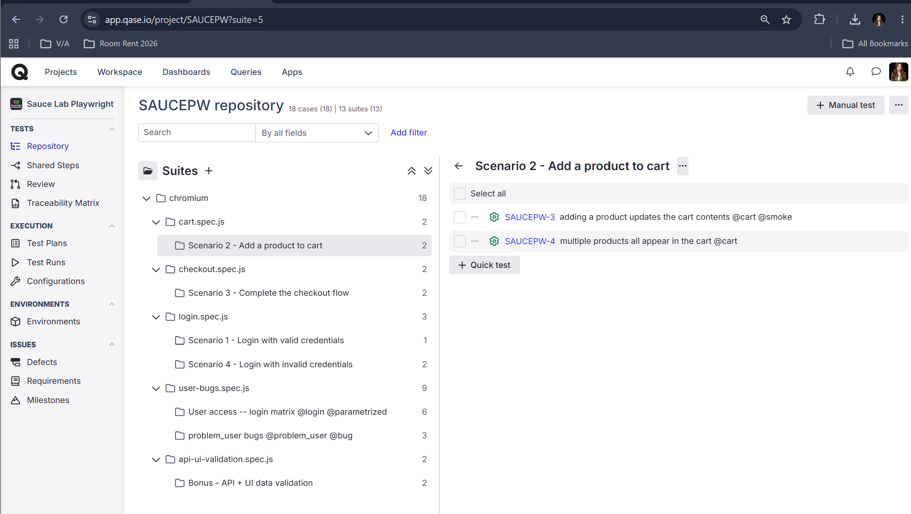

# SauceDemo Playwright Test Framework

End-to-end UI + API automation for
[https://www.saucedemo.com](https://www.saucedemo.com), built with Playwright,
the Page Object Model, a symmetric API-request layer, and CI + Qase.io
reporting wired end-to-end. The point of this repo is to show the whole
pipeline working in one command.

1. [Quick start](#1-quick-start)
2. [Run modes](#2-run-modes)
3. [What's tested](#3-whats-tested)
4. [Test case inventory (all 39 tests)](#4-test-case-inventory-all-39-tests)
5. [Assumptions & rationale](#5-assumptions--rationale)
6. [Screenshots -- CI, PR reports, Qase.io](#6-screenshots----ci-pr-reports-qaseio)
7. [Additional information](#7-additional-information)

---

## 1. Quick start

```bash
git clone git@github.com:Intzu3999/saucedemo_test_playwright.git
cd saucedemo_test_playwright

# one command: installs Node deps + Chromium + creates .env from .env.example
npm run setup

# run
npm test

# open the HTML report
npx playwright show-report
```

Requires **Node.js 20+** on `PATH`. `npm run setup` is idempotent -- safe to
re-run any time. It never overwrites an existing `.env`.

<details>
<summary>Manual setup (if you prefer not to run the script)</summary>

```bash
npm ci
npx playwright install --with-deps chromium
cp .env.example .env    # then edit .env to add your Qase.io token
```

</details>

**What you should see after `npm test` (39 tests total):**

- **29 pass** -- everything the framework claims should work, works. Includes
  one `@known-bug`-tagged test that currently meets its assertion (SauceDemo's
  delay is action-specific -- more on that under
  [Assumptions & rationale](#5-assumptions--rationale)).
- **10 fail** -- all tagged `@known-bug`. Every one is a real SauceDemo
  product defect. The tests assert the correct behaviour and let the bug
  show up as red. One of the ten (the `performance_glitch_user` login SLA)
  sits close enough to its threshold that a retry can pass, in which case
  Playwright reports it as *flaky* and the tally reads 9 failed + 1 flaky.

---

## 2. Run modes

Everything is either `npm test` + a filter, or an ad-hoc `npx playwright test`
invocation. Flags after `--` are forwarded to Playwright.

| # | Command | What it runs | Expected result |
|---|---|---|---|
| 1 | `npm test` | Full suite -- 39 tests | 29 pass + 10 fail (10 real SauceDemo bugs, all tagged `@known-bug`) |
| 2 | `npm run test:ci` | Full suite minus `@known-bug` -- 28 tests | All green |
| 2b | `npm test && npm run ci:gate` | What CI does: full suite, then grade it | Gate passes if only `@known-bug` tests failed |
| 3 | `npm run test:known-bugs` | Only `@known-bug` -- 11 tests | 10 fail + 1 pass (SauceDemo behaves correctly on that one today) |
| 4 | `npm run test:smoke` | Only `@smoke` -- 4 tests | 4 pass |
| 5 | `npm test -- --headed` | Full suite with a visible browser | Same as row 1 |
| 6 | `npm test -- --ui` | Playwright's interactive UI mode | Interactive |
| 7 | `npm test -- --debug` | Playwright Inspector (step-through debugger) | Interactive |
| 8 | `npx playwright test --grep "@smoke"` | Any test whose title contains `@smoke` (any tag works) | Depends on filter |
| 9 | `npx playwright test tests/login.spec.js` | One spec file | Depends on file |
| 10 | `npx playwright show-report` | Opens the last HTML report | Report UI |

> **Tags are just strings in test titles.** `test:known-bugs` and `test:smoke`
> are npm shortcuts for `playwright test --grep "@known-bug"` and
> `--grep "@smoke"`. To include a new test in a filter, add the tag to the
> test title -- no config change needed. Full tag list in
> [`docs/test-cases.md`](./docs/test-cases.md).

---

## 3. What's tested

The 39 tests split into four buckets. Every count and status here is
verifiable against the code today (Aug 2026). Per-test detail is in
[section 4](#4-test-case-inventory-all-39-tests).

| Bucket | Count | Expected result | Details |
|---|---|---|---|
| **Required scenarios (assignment 1-4)** | 7 | 7 pass | Valid login, add-to-cart, checkout happy-path + negative, invalid login, locked-out login. See [4.1](#41-loginspecjs----3-tests-required-scenarios-1--4), [4.2](#42-cartspecjs----2-tests-required-scenario-2), [4.3](#43-checkoutspecjs----2-tests-required-scenario-3). |
| **API layer** | 12 | 12 pass | DummyJSON `/users/1` (bonus API + UI cross-check) + `/carts` full CRUD contract + negative cases. See [4.4](#44-api-ui-validationspecjs----2-tests-bonus-api--ui-cross-check), [4.5](#45-api-cartsspecjs----10-tests-api-contract-suite). |
| **Login access matrix (6 users)** | 6 | 6 pass | Parametrised: every SauceDemo user reaches its expected outcome. See [4.6](#46-user-bugsspecjs----20-tests). |
| **Known-bug regression (5 buggy users)** | 14 | 4 pass + 10 fail | Every failing test = a real SauceDemo defect. Includes the parametrised add-to-cart matrix (3 pass, 3 fail -- confirms `problem_user`'s "random" bug is actually deterministic). See [4.7](#47-problem_user-bugs----9-tests-6-pass-3-fail) onward. |
| **Total** | **39** | **29 pass + 10 fail** | -- |

---

## 4. Test case inventory (all 39 tests)

Every test in the suite, in the order Playwright reports it. Numbering is
stable and matches [`docs/test-cases.md`](./docs/test-cases.md), which is
verified against `npx playwright test --list`.

**Legend for Expected result:**

| Verdict | Meaning |
|---|---|
| **PASS** | Test asserts correct behaviour and SauceDemo behaves correctly. |
| **FAIL (known bug)** | Test asserts correct behaviour; SauceDemo has a real defect. Tagged `@known-bug` and excluded from CI. |
| **PASS (`@known-bug`)** | Tagged as a known bug but currently passes -- the asserted SLA is met today, or SauceDemo silently fixed it. |
| **FAIL (unexpected)** | Not expected anywhere below. Indicates a regression: a SauceDemo change or a framework issue. |
| **SKIPPED** | Test was filtered out or skipped by a conditional. No test is skipped in the default run. |
| **BLOCKED** | Test could not run (upstream dependency down, environment issue). |

### 4.1 `login.spec.js` -- 3 tests (required Scenarios 1 & 4)

| # | Test | What it asserts | Tags | Expected result |
|---|---|---|---|---|
| 1 | `Login -- valid credentials > valid user lands on the inventory page` | `standard_user` reaches `/inventory.html` and sees more than 0 products | `@login @smoke` | PASS |
| 2 | `Login -- invalid credentials > invalid user sees the expected error message` | Wrong username/password shows the expected error banner and stays on login | `@login @negative` | PASS |
| 3 | `Login -- invalid credentials > locked-out user sees the locked-out error` | `locked_out_user` sees "Sorry, this user has been locked out." | `@login @negative` | PASS |

### 4.2 `cart.spec.js` -- 2 tests (required Scenario 2)

| # | Test | What it asserts | Tags | Expected result |
|---|---|---|---|---|
| 4 | `Cart -- add product > adding a product updates the cart contents` | Add Backpack; badge shows 1; cart page lists the product | `@cart @smoke` | PASS |
| 5 | `Cart -- add product > multiple products all appear in the cart` | Add Backpack + Bike Light; both appear on the cart page | `@cart` | PASS |

### 4.3 `checkout.spec.js` -- 2 tests (required Scenario 3)

| # | Test | What it asserts | Tags | Expected result |
|---|---|---|---|---|
| 6 | `Checkout -- happy path + validation > user can checkout successfully and see confirmation` | Full happy path: add product, step 1, step 2, finish, order-complete page | `@checkout @smoke @e2e` | PASS |
| 7 | `Checkout -- happy path + validation > missing first name blocks checkout progression` | Empty first name surfaces "First Name is required" and blocks progress | `@checkout @negative` | PASS |

### 4.4 `api-ui-validation.spec.js` -- 2 tests (Bonus: API + UI cross-check)

| # | Test | What it asserts | Tags | Expected result |
|---|---|---|---|---|
| 8 | `Bonus -- API + UI data validation > checkout uses API-sourced customer data and UI reflects it` | Fetch DummyJSON `/users/1`, drive SauceDemo checkout with those values, expect success | `@api @ui @bonus` | PASS |
| 9 | `Bonus -- API + UI data validation > API contract sanity check @contract` | DummyJSON `/users/1` returns 200 with the expected user schema | `@api @ui @bonus @contract` | PASS |

### 4.5 `api-carts.spec.js` -- 10 tests (API contract suite)

Covers every HTTP verb against DummyJSON `/carts` through the API client
layer in `api/`.

| # | Verb | Endpoint | What it asserts | Tags | Expected result |
|---|---|---|---|---|---|
| 10 | GET | `/carts?limit=5&skip=0` | 200, paginated cart list matching the schema | `@api @carts @smoke` | PASS |
| 11 | GET | `/carts/1` | 200, single cart matching `cartSchema`, `id === 1` | `@api @carts` | PASS |
| 12 | GET | `/carts/user/5` | 200, every returned cart has `userId === 5` | `@api @carts` | PASS |
| 13 | POST | `/carts/add` | 200, correct computed `totalProducts` and `totalQuantity` | `@api @carts` | PASS |
| 14 | PUT | `/carts/1` (`merge: true`) | 200, keeps existing products and adds the new one | `@api @carts` | PASS |
| 15 | PATCH | `/carts/1` (`merge: false`) | 200, replaces the product list entirely | `@api @carts` | PASS |
| 16 | DELETE | `/carts/1` | 200, `isDeleted: true` plus a `deletedOn` timestamp | `@api @carts` | PASS |
| 17 | GET | `/carts/99999` | 404 with a `message` field | `@api @carts @negative` | PASS |
| 18 | GET | `/carts?limit=-1` | Records current behaviour (the public sandbox is lenient) | `@api @carts @negative` | PASS |
| 19 | GET | `/carts?limit=10000` | Records current behaviour when limit exceeds the max | `@api @carts @negative` | PASS |

### 4.6 `user-bugs.spec.js` -- 20 tests

#### Login-access matrix -- parametrised across 6 users (6 tests)

Every SauceDemo user should reach its expected outcome from the login page.

| # | Test | What it asserts | Tags | Expected result |
|---|---|---|---|---|
| 20 | `User access -- login matrix > login access -- standard_user` | Logs in, expects `/inventory.html` | `@login @parametrized` | PASS |
| 21 | `User access -- login matrix > login access -- locked_out_user` | Sees the locked-out error, stays on login | `@login @parametrized` | PASS |
| 22 | `User access -- login matrix > login access -- problem_user` | Logs in, expects `/inventory.html` | `@login @parametrized` | PASS |
| 23 | `User access -- login matrix > login access -- performance_glitch_user` | Logs in, expects `/inventory.html` | `@login @parametrized` | PASS |
| 24 | `User access -- login matrix > login access -- error_user` | Logs in, expects `/inventory.html` | `@login @parametrized` | PASS |
| 25 | `User access -- login matrix > login access -- visual_user` | Logs in, expects `/inventory.html` | `@login @parametrized` | PASS |

### 4.7 `problem_user` bugs -- 9 tests (6 pass, 3 fail)

Includes the parametrised add-to-cart matrix across all 6 products.

| # | Test | What it asserts | Tags | Expected result |
|---|---|---|---|---|
| 26 | `problem_user bugs > every product image should have a unique src @known-bug` | All 6 product images should have distinct `src` URLs -- all 6 are the same placeholder | `@problem_user @bug @known-bug` | **FAIL (known bug)** |
| 27 | `problem_user bugs > can add "Sauce Labs Backpack" to cart` | Add Backpack; badge = 1 | `@problem_user @bug` | PASS |
| 28 | `problem_user bugs > can add "Sauce Labs Bike Light" to cart` | Add Bike Light; badge = 1 | `@problem_user @bug` | PASS |
| 29 | `problem_user bugs > can add "Sauce Labs Bolt T-Shirt" to cart @known-bug` | Add Bolt T-Shirt; badge = 1 -- click is silently swallowed | `@problem_user @bug @known-bug` | **FAIL (known bug)** |
| 30 | `problem_user bugs > can add "Sauce Labs Fleece Jacket" to cart @known-bug` | Add Fleece Jacket; badge = 1 -- click is silently swallowed | `@problem_user @bug @known-bug` | **FAIL (known bug)** |
| 31 | `problem_user bugs > can add "Sauce Labs Onesie" to cart` | Add Onesie; badge = 1 | `@problem_user @bug` | PASS |
| 32 | `problem_user bugs > can add "Test.allTheThings() T-Shirt (Red)" to cart @known-bug` | Add Red T-Shirt; badge = 1 -- click is silently swallowed | `@problem_user @bug @known-bug` | **FAIL (known bug)** |
| 33 | `problem_user bugs > can remove product after adding @known-bug` | Add then Remove; badge = 0 -- the Remove button is a no-op | `@problem_user @bug @known-bug` | **FAIL (known bug)** |
| 34 | `problem_user bugs > checkout last-name field accepts input independently of first-name @known-bug` | Typing into Last Name should not leak into First Name -- keystrokes cross fields | `@problem_user @bug @known-bug` | **FAIL (known bug)** |

> **Automation-only finding.** Rows 27-32 are the same test parametrised over
> all 6 products, which is what proved the "random" add-to-cart bug is
> actually deterministic: products 1, 2 and 5 work; products 3, 4 and 6 never
> do. See [5.4](#54-automation-only-finding-problem_users-random-bug-is-deterministic).

### 4.8 `performance_glitch_user` bugs -- 2 tests (1 pass, 1 fail)

| # | Test | What it asserts | Tags | Expected result |
|---|---|---|---|---|
| 35 | `performance_glitch_user bugs > login redirect completes within SLA @known-bug` | Login reaches `/inventory.html` in under 3000 ms -- takes 5+ seconds | `@performance_glitch_user @bug @known-bug` | **FAIL (known bug)** -- occasionally reported as *flaky*, see note |
| 36 | `performance_glitch_user bugs > add-to-cart click reflects on the cart badge within SLA @known-bug` | Add-to-Cart updates the badge in under 3000 ms -- SLA is met today | `@performance_glitch_user @bug @known-bug` | **PASS (`@known-bug`)** |

> **Note on test 36:** the 3-second SLA *is* met on the Add-to-Cart action
> today, even though the login redirect in test 35 is still slow. This is a
> good example of automation quantifying something manual testing cannot:
> SauceDemo's intentional delay appears to be wired per-action rather than
> globally. If the site regresses, this test starts failing.

> **Note on test 35:** this is the one genuinely borderline result in the
> suite. Retries are on by default (`RETRIES=1` locally, 2 in CI), so when a
> retry happens to land under the 3-second SLA, Playwright reports the test
> as **flaky** rather than failed -- the run summary then reads
> "29 passed, 9 failed, 1 flaky" instead of "29 passed, 10 failed". Either
> way the defect is real and the test is excluded from CI. Run
> `npm test -- --retries=0` to see it fail deterministically.

### 4.9 `error_user` bugs -- 2 tests (both fail)

| # | Test | What it asserts | Tags | Expected result |
|---|---|---|---|---|
| 37 | `error_user bugs > checkout last-name field is responsive @known-bug` | The Last Name input should accept typed characters -- it ignores keyboard input | `@error_user @bug @known-bug` | **FAIL (known bug)** |
| 38 | `error_user bugs > submitting checkout with empty last name shows an inline error @known-bug` | Continue with an empty Last Name should show the required-field error -- it silently navigates back | `@error_user @bug @known-bug` | **FAIL (known bug)** |

### 4.10 `visual_user` bugs -- 1 test (fails)

| # | Test | What it asserts | Tags | Expected result |
|---|---|---|---|---|
| 39 | `visual_user bugs > 6th product Add-to-Cart button stays inside its card @known-bug` | The 6th card's Add-to-Cart button should not overflow its parent card -- it does | `@visual_user @bug @known-bug` | **FAIL (known bug)** |

---

## 5. Assumptions & rationale

Read this if you want to understand *why* the results tables above look the
way they do.

### 5.1 What is being tested

The application under test is **SauceDemo itself**, a public demo. SauceDemo
is a frozen fixture designed to ship intentional bugs baked in per user
account. The tests treat those intentional bugs as **real product defects**
and assert the correct behaviour -- exactly as if this were a production
application.

### 5.2 Why bugs are visible as RED (no `test.fail()`)

SauceDemo ships six user accounts. Five of them (`problem`, `performance_glitch`,
`error`, `visual`, plus the special `locked_out`) intentionally exhibit
distinct UI or performance bugs. See
[`test-data/users.json`](./test-data/users.json).

- A known bug should be visible as a red fail in **both** Playwright's HTML
  report and Qase.io. Only that way can a reviewer tell at a glance which
  tests correspond to defects.
- Earlier iterations used Playwright's `test.fail()` marker, which made
  Playwright show them GREEN (expected failure) while Qase showed them RED
  (failed). That inconsistency was removed. **Bug present = RED everywhere.**
- CI runs the **full** suite, so the Playwright report and the Qase run show
  all 39 tests with the 10 known bugs red -- a filtered, all-green subset
  would defeat the point of surfacing them. The check still goes green,
  because `scripts/ci-gate.mjs` grades the run afterwards and only fails the
  build when a test *outside* `@known-bug` fails. Expected bug failures never
  block a merge; a genuine regression does.
- The gate also flags any `@known-bug` test that **passed**. That means
  SauceDemo fixed the defect, so the tag should be dropped -- at which point
  CI starts protecting the fix.

### 5.3 What "PASS" and "FAIL" mean here

See the [legend in section 4](#4-test-case-inventory-all-39-tests). The short
version: PASS means the feature works as the site's own documentation claims,
and FAIL (known bug) means the framework caught an intentional SauceDemo
defect. Anything outside those two categories needs investigation.

### 5.4 Automation-only finding: `problem_user`'s "random" bug is deterministic

The assignment prompt described the `problem_user` Add-to-Cart failure as
"random". Parametrising the test across all 6 products revealed the
"randomness" is actually deterministic:

- Products **1 (Backpack), 2 (Bike Light), 5 (Onesie)** -- Add-to-Cart works.
- Products **3 (Bolt T-Shirt), 4 (Fleece Jacket), 6 (Red T-Shirt)** -- click
  is silently swallowed.

Documented example of automation adding QA signal manual observation missed.

### 5.5 Other assumptions

- The default password `secret_sauce` is public demo data and is checked in
  to `.env.example` -- not a secret leak.
- `.env` (with the real Qase token) is gitignored and never committed.
- Chromium alone is sufficient for the assignment; Firefox / WebKit projects
  are commented out in `playwright.config.js`.
- The corporate SSL workaround (`IGNORE_HTTPS_ERRORS`) is off by default and
  is only ever needed locally when running behind a proxy that MITMs TLS
  (e.g. Zscaler). CI leaves it off so TLS verification stays strict.

---

## 6. Screenshots -- CI, PR reports, Qase.io

The pipeline runs on every push and PR, publishes the HTML report to its own
folder on GitHub Pages, and posts a PR comment linking to both that run's
Playwright report and its Qase.io public run. Both links are unique per run,
so earlier reports stay reachable.

To try it end-to-end:

1. Clone, then check out a feature branch: `git checkout -b feature/demo`.
2. Make any trivial change (edit README, touch an empty file).
3. Commit and push the branch.
4. Open a PR into `main`.
5. Wait for the CI check to complete.
6. Open the two report URLs from the sticky PR comment.

All screenshots live in [`images/`](./images) and are referenced by relative
path, so they render on GitHub and in any local Markdown preview without
depending on external hosting. They come from the first end-to-end runs of
the pipeline --
[PR #1](https://github.com/Intzu3999/saucedemo_test_playwright/pull/1) and
[PR #2](https://github.com/Intzu3999/saucedemo_test_playwright/pull/2).

**GitHub Actions workflow triggered on PR:**



**Playwright HTML report (downloadable artefact from CI):**



Example artefact download URL:
[`actions/runs/32875492209/artifacts/9573767079`](https://github.com/Intzu3999/saucedemo_test_playwright/actions/runs/32875492209/artifacts/9573767079)

**Sticky PR comment linking to both reports:**


**Qase.io -- test run created automatically from Playwright:**



**Qase.io -- individual test cases with steps:**



**Qase.io -- test result dashboard:**



---

## 7. Additional information

### 7.1 Framework overview

- **Language / runtime:** JavaScript on Node.js 20+.
- **Test runner:** `@playwright/test`.
- **Design pattern:** Page Object Model for UI (`pages/*.js`) with a
  symmetric API-request layer (`api/*.js`). Locators and HTTP details live
  inside those classes; specs only call semantic methods.
- **Test data:** externalised as JSON (`test-data/*.json`) and consumed via
  `utils/helpers.js`.
- **Fixtures:** `utils/fixtures.js` extends Playwright's `test` to inject
  pre-configured API clients (`dummyJsonUsers`, `dummyJsonCarts`) the same
  way `page` is injected for UI tests.
- **Reporting:** Playwright HTML + JUnit XML + optional Qase.io TestOps
  publishing.
- **Failure diagnostics:** screenshots (on failure), videos and traces
  (retained on failure) under `test-results/`.
- **CI/CD:** GitHub Actions workflow (`.github/workflows/playwright.yml`)
  and a Jenkins declarative pipeline (`Jenkinsfile`) both pre-wired.

### 7.2 Folder structure

```
saucedemo_test_playwright/
├── .github/workflows/                  # GitHub Actions CI workflow
├── pages/                              # Page Object Models (UI)
│   ├── BasePage.js
│   ├── LoginPage.js
│   ├── InventoryPage.js
│   ├── CartPage.js
│   ├── CheckoutPage.js
│   └── CompletePage.js
├── api/                                # API request objects (POM for HTTP)
│   ├── BaseApi.js                        # get / post / put / patch / delete
│   ├── DummyJsonUsersApi.js              # /users endpoints
│   ├── DummyJsonCartsApi.js              # /carts endpoints (all verbs)
│   ├── schemas.js                        # response shape validators
│   └── index.js
├── tests/                              # Test specs
│   ├── login.spec.js                     # required Scenarios 1 & 4
│   ├── cart.spec.js                      # required Scenario 2
│   ├── checkout.spec.js                  # required Scenario 3
│   ├── api-ui-validation.spec.js         # Bonus (API + UI cross-check)
│   ├── api-carts.spec.js                 # API-only: GET/POST/PUT/PATCH/DELETE
│   └── user-bugs.spec.js                 # Known-bug matrix for all 6 users
├── test-data/                          # JSON test data (no logic)
│   ├── users.json
│   ├── products.json
│   └── checkout.json
├── utils/                              # Helpers + Playwright fixtures
│   ├── helpers.js                        # loginAs*, testData, envOrDefault
│   └── fixtures.js                       # test.extend + API-client injection
├── docs/                               # Reference docs (only test-cases.md is committed)
│   └── test-cases.md                     # Full 39-test inventory + tags
│                                          # (other files under docs/ are gitignored
│                                          #  personal working notes)
├── postman/                            # Postman collections (DummyJSON, Qase)
│   ├── DummyJSON-Carts.postman_collection.json
│   ├── Qase-TestCases.postman_collection.json
│   └── README.md
├── images/                             # All README screenshots
│   ├── ci-github-actions-workflow.png
│   ├── playwright-html-report.png
│   ├── pr2-sticky-comment.jpg
│   ├── qase-test-run.png
│   ├── qase-test-cases-steps.png
│   └── qase-result-dashboard.png
├── scripts/                            # Ops scripts (Node CLIs)
│   ├── setup.mjs                         # First-time repo setup
│   ├── qase-cleanup.mjs                  # Clear stuck / phantom Qase runs
│   └── build-report-index.mjs            # Builds the gh-pages report index
├── playwright.config.js                # Playwright + reporters config
├── Jenkinsfile                         # Jenkins declarative pipeline
├── .env                                # Local secrets (gitignored)
├── .env.example                        # Template for .env
├── README.md
└── package.json
```

### 7.3 Reports & artefacts

- **HTML report:** `playwright-report/index.html` -- open with
  `npx playwright show-report`.
- **JUnit XML:** `test-results/junit.xml` -- consumed by CI.
- **Traces / videos / screenshots:** `test-results/` -- kept only for
  failing tests.

### 7.4 Qase.io integration

Already wired end-to-end. `.env` holds the API token and the project code
(`SAUCEPW`). Set `QASE_MODE=testops` to publish results; leave `off` to run
purely locally.

When `QASE_TESTOPS_SHOW_PUBLIC_REPORT_LINK=true` (default in `.env`), the
reporter prints both URLs at the end of every run:

```
qase: Test run link:      https://app.qase.io/run/SAUCEPW/dashboard/<id>
qase: Public report link: https://app.qase.io/public/report/<token>
```

The internal link needs a Qase login; the public link is view-only, no login.

#### Cleaning up phantom / stuck Qase runs

If a test run is aborted (Ctrl+C, IDE kill, crash), the reporter's `onBegin`
already created the run on Qase but `onEnd` never fires -- so the run is
stuck "In progress" with 0 stats. Fix with:

```bash
npm run qase:cleanup                    # dry-run: show stuck + empty runs
npm run qase:cleanup -- --complete      # mark stuck runs complete
npm run qase:cleanup -- --delete-empty  # delete runs with 0 results
npm run qase:cleanup:auto               # both (--all)
```

Script lives at `scripts/qase-cleanup.mjs` and reuses the
`QASE_TESTOPS_API_TOKEN` / `QASE_TESTOPS_PROJECT` from `.env`.

### 7.5 CI/CD

- **GitHub Actions** (`.github/workflows/playwright.yml`) runs on push,
  pull request, and manual trigger. Installs Node 20, dependencies, and
  Chromium, then runs the full suite and grades it with
  `scripts/ci-gate.mjs`, which fails the build only on failures outside
  `@known-bug`. Uploads
  `playwright-report/` + `test-results/` as artefacts. It then publishes the
  HTML report to GitHub Pages under a per-run folder
  (`reports/pr-<n>/run-<n>/`) and posts a fresh PR comment linking to that
  run's Playwright report and its Qase.io public run.
- **GitHub Pages setup (one-time):** Settings -> Pages -> Source
  "Deploy from a branch", branch `gh-pages`, folder `/ (root)`. Reports
  accumulate on that branch, so recent runs stay reachable. The site root
  lists every published run -- it is regenerated on each publish by
  `scripts/build-report-index.mjs`, which also prunes to the 5 newest runs
  per PR/branch (`--keep 5`) to stay inside the 1 GB Pages limit.
- **Jenkins** (`Jenkinsfile`) has parity with the GitHub workflow:
  install, browsers, tests, publish JUnit + HTML.

### 7.6 License

MIT
